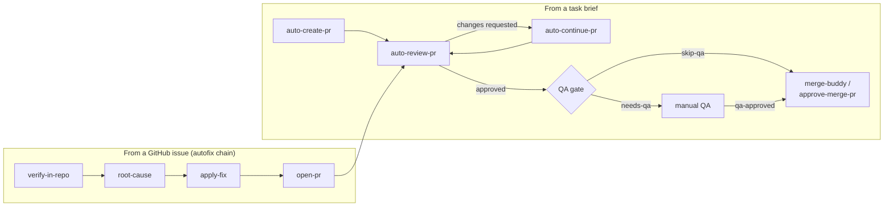

# Open Mercato Skills

Fifteen agent skills that run a full PR pipeline: plan, implement, review, QA gate, merge. Install them into any repo, with any coding agent.

<!-- PIOTR: rewrite in your voice -->
These skills wrote and shipped a real product. Inside the [Open Mercato](https://github.com/open-mercato/open-mercato) project, this workflow produced ~800k lines of code with zero hand-written lines, 1700+ merged PRs, 4000 unit tests, 730 integration tests, and weekly releases, with 100+ contributors working through it. This repository extracts the pipeline itself, stripped of everything product-specific, so any team with a GitHub repo can run it.

## 30-second quickstart

```bash
npx skills add open-mercato/skills
```

This installs the skills for 22+ coding agents (Claude Code, Cursor, Codex, and others) via [skills.sh](https://skills.sh).

Then, once per repository:

```
/setup-agent-pipeline
```

It inspects your repo (default branch, validation scripts, GitHub labels), asks a few questions, and writes `.ai/agentic.config.json`. Every other skill reads that file.

Then ship something:

```
/auto-create-pr "add rate limiting to the login endpoint"
```

The agent drafts an execution plan, implements it phase by phase in an isolated worktree, runs your validation commands, reviews its own diff, and opens a labeled, reviewed PR.

## The pipeline

Two entry paths: hand the agent a task brief, or hand it a GitHub issue. Both converge on the same review loop and the same QA gate. Skills claim PRs and issues with an `in-progress` label, so concurrent agents back off instead of colliding.



## Skill catalog

### You invoke

| Skill | What it does |
|---|---|
| `setup-agent-pipeline` | One-per-repo configurator. Inspects the repository, asks a few questions, writes `.ai/agentic.config.json`. |
| `auto-create-pr` | Takes a free-form task brief end-to-end: execution plan, isolated worktree, phase-by-phase commits, validation gate, labeled PR. Resumable. |
| `auto-continue-pr` | Resumes an in-progress PR from the first unchecked step in its tracking plan. |
| `auto-review-pr` | Reviews a PR by number in an isolated worktree, approves or requests changes, manages labels. On changes-requested, its autofix loop iterates fixes and re-review until merge-ready. |
| `review-prs` | Sweeps all unreviewed open PRs, newest first, through `auto-review-pr`, respecting claim locks. |
| `merge-buddy` | Scans open PRs and reports which can merge now and which are close but blocked, based on labels, reviews, CI, and mergeability. |
| `approve-merge-pr` | Approves and squash-merges a PR given only its number. Can file a follow-up issue at the same time. |
| `check-and-commit` | Runs the configured validation gate on the current branch, fixes obvious drift, then commits and pushes when green. |
| `sync-merged-pr-issues` | Post-merge housekeeping: closes issues that merged PRs fix, comments on issues whose PRs were closed without merging. |
| `followup-issue-from-pr` | Turns a PR or a PR comment into a tracked follow-up issue, assigned to the right person. |

### Skills invoke each other

The building blocks behind the autofix chain and the review loop. You can call them directly, but they mainly exist for the other skills to compose.

| Skill | What it does |
|---|---|
| `verify-in-repo` | Read-only triage gate: decides whether a GitHub issue is a real, still-unfixed defect, and stops the chain cleanly when there is nothing to do. |
| `root-cause` | Read-only analysis: locates the bug and the minimal change surface so the fix step never re-explores the repo. |
| `apply-fix` | Implements the minimal change, adds regression tests, runs the validation gate. Does not commit or push. |
| `open-pr` | Commits the worktree, pushes the branch, opens the PR, normalizes labels, releases the claim lock. |
| `code-review` | The review checklist behind `auto-review-pr`: correctness, security, contract surfaces, plus your repo-local checklist when configured. |

## Works with any stack

Nothing here assumes JavaScript, or any particular product. The base branch, the validation commands, the label taxonomy, and the working paths all come from one committed file, `.ai/agentic.config.json`, written by `setup-agent-pipeline`:

```json
{
  "version": 1,
  "baseBranch": "auto",
  "validation": {
    "commands": ["pnpm typecheck", "pnpm test", "pnpm build"]
  },
  "labels": {
    "enabled": true,
    "pipeline": ["review", "changes-requested", "qa", "qa-failed", "merge-queue", "blocked", "do-not-merge"],
    "category": ["bug", "feature", "refactor", "security", "dependencies", "documentation"],
    "meta": ["needs-qa", "skip-qa", "qa-approved", "qa-self-verified", "in-progress"],
    "priority": ["priority-low", "priority-medium", "priority-high", "priority-extreme"],
    "risk": ["risk-low", "risk-medium", "risk-high"]
  },
  "qaGate": true,
  "paths": {
    "runs": ".ai/runs",
    "analysis": ".ai/analysis"
  },
  "reviewChecklist": null
}
```

A Rust repo puts `cargo test` and `cargo clippy` in `validation.commands`; a Go repo puts `go test ./...`. Skills run whatever you configure and treat any non-zero exit as a gate failure. A skill invoked in a repo without the config stops and points you at `setup-agent-pipeline`.

## Labels and the QA gate

Every PR carries at most one pipeline label (`review`, `changes-requested`, `merge-queue`, ...) plus additive category, meta, priority, and risk labels; priority says how urgent the work is, risk says how dangerous the change is to ship. The full taxonomy, and whether to use labels at all, lives in the config; `setup-agent-pipeline` documents every group and creates missing labels for you.

The QA gate is the one hard rule: a PR labeled `needs-qa` cannot merge until a human adds `qa-approved`, no matter how green the checks are. Automated skills request QA; they never grant it.

## Built with this workflow

<!-- PROOF: case studies land here before launch -->

Real production case studies are being added here.

---

<!-- PIOTR: rewrite in your voice -->
Built by the [Open Mercato](https://github.com/open-mercato/open-mercato) team, where these skills ship the product every week. We teach this way of working at [aitechleaders.pl](https://aitechleaders.pl) (an AI engineering course, in Polish).
