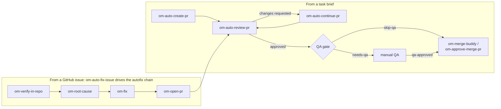

<p align="center">
  <a href="https://github.com/open-mercato/open-mercato">
    
  </a>
</p>

<h1 align="center">Open Mercato Skills</h1>

<p align="center">
  <b>🧠 plan · 🔨 implement · 🔍 review · ✅ QA gate · 🚢 merge</b><br/>
  Twenty-five agent skills that run a full PR pipeline. Install them into any repo, with any coding agent.
</p>

<p align="center">
  <a href="LICENSE"></a>
  <a href="https://skills.sh"></a>
  <a href="https://github.com/open-mercato/skills/pulls"></a>
</p>

<!-- PIOTR: rewrite in your voice -->
These skills wrote and shipped a real product. Inside the [Open Mercato](https://github.com/open-mercato/open-mercato) project, this workflow produced ~800k lines of code with zero hand-written lines, 1700+ merged PRs, 4000 unit tests, 730 integration tests, and weekly releases, with 100+ contributors working through it. This repository extracts the pipeline itself, stripped of everything product-specific, so any team with a GitHub repo can run it.

## ⚡ 30-second quickstart

```bash
npx skills add open-mercato/skills --skill '*'
```

Install all twenty-five — the pipeline composes, and every skill is small until invoked. Drop `--skill '*'` to cherry-pick interactively. Skills install for 22+ coding agents (Claude Code, Cursor, Codex, and others) via [skills.sh](https://skills.sh).

Then, once per repository:

```
/om-setup-agent-pipeline
```

It inspects your repo (default branch, validation scripts, GitHub labels), asks a few questions, writes `.ai/agentic.config.json`, and generates `SDLC.md` — your team's ticket-flow doc. Every other skill reads the config.

Then ship something:

```
/om-auto-create-pr "add rate limiting to the login endpoint"
```

The agent drafts an execution plan, implements it phase by phase in an isolated worktree, runs your validation commands, reviews its own diff, and opens a labeled, reviewed PR.

## 🛠️ Local development

Working on the skills themselves? Skip the `npx skills add` round-trip and symlink this checkout straight into your agents' skill directories:

```bash
npm run install-skills
```

This links every skill in `skills/` into `~/.claude/skills` (Claude Code) and `~/.codex/skills` (Codex). Because they are symlinks, any edit you make in this repo is live on the next skill invocation — no reinstall needed.

Options:

```bash
npm run install-skills -- --agent claude   # only one agent (claude or codex)
npm run install-skills -- --force          # replace existing non-symlink installs
npm run uninstall-skills                   # remove only the links owned by this repo
```

The installer never touches skills it does not own: an existing real directory (e.g. installed earlier via `npx skills add`) is skipped with a warning unless you pass `--force`, and uninstall removes only symlinks that point into this checkout.

## 🔁 The pipeline

Two entry paths: hand the agent a task brief (`om-auto-create-pr`), or hand it a GitHub issue (`om-auto-fix-issue`, which drives the autofix chain). Both converge on the same review loop and the same QA gate. Skills claim PRs and issues with an `in-progress` label, so concurrent agents back off instead of colliding.



## 📦 Skill catalog

### 🤖 Autonomous skills

Hand these a brief, an issue, or nothing at all — they run end-to-end without supervision: they claim their work with the `in-progress` lock so concurrent agents back off, work in isolated worktrees so your checkout stays untouched, run the validation gate, self-review, and finish with a PR, a review verdict, or a reconciled tracker. Safe to run on a schedule or in CI.

| Skill | What it does autonomously |
|---|---|
| `om-auto-create-pr` | Takes a free-form task brief end-to-end: execution plan, isolated worktree, phase-by-phase commits, validation gate, self-review, labeled PR, then an autofix review loop until clean. Resumable. |
| `om-auto-create-pr-loop` | Advanced om-auto-create-pr for long spec implementations: run folder with PLAN/HANDOFF/NOTIFY, one commit per step, checkpoint verification every ~5 steps, executor-dispatch for many-step runs, full gate at completion. |
| `om-auto-fix-issue` | Fixes a tracker issue end-to-end by driving the autofix chain: triage gate, root-cause analysis, minimal fix with regression tests, labeled draft PR, autofix review loop. Stops cleanly when the issue is already solved or claimed. |
| `om-auto-continue-pr` | Resumes an in-progress PR from the first unchecked step in its tracking plan and carries it to completion — implementation, validation, review loop, summary comment. |
| `om-auto-continue-pr-loop` | Resumes runs started by `om-auto-create-pr-loop`: orients from HANDOFF.md, picks up at the first non-done Tasks-table row, keeps the per-step commit and checkpoint discipline to completion. |
| `om-auto-review-pr` | Reviews a PR by number in an isolated worktree, approves or requests changes, manages labels. On changes-requested, its autofix loop iterates fixes and re-review until merge-ready. |
| `om-review-prs` | Sweeps all unreviewed open PRs, newest first, through `om-auto-review-pr`, respecting claim locks. |
| `om-sync-merged-pr-issues` | Post-merge housekeeping sweep: closes issues that merged PRs fix, comments on issues whose PRs were closed without merging. |
| `om-stabilize-ci` | Drives a PR or branch to green CI: reads failing checks and their logs through tracker operations, classifies each failure (real bug / test bug / flake / infra), fixes with tests in an isolated worktree, pushes, and re-checks until every required check passes. Never fakes green. |

### 🧑‍💻 You invoke

Interactive helpers: they act once, report, and hand control back to you.

| Skill | What it does |
|---|---|
| `om-setup-agent-pipeline` | One-per-repo configurator. Inspects the repository, asks a few questions, writes `.ai/agentic.config.json`, installs the tracker descriptor, generates `SDLC.md` and an `AGENTS.md` starter when missing. |
| `om-merge-buddy` | Scans open PRs and reports which can merge now and which are close but blocked, based on labels, reviews, CI, and mergeability. |
| `om-approve-merge-pr` | Approves and squash-merges a PR given only its number. Can file a follow-up issue at the same time. |
| `om-check-and-commit` | Runs the configured validation gate on the current branch, fixes obvious drift, then commits and pushes when green. |
| `om-followup-issue-from-pr` | Turns a PR or a PR comment into a tracked follow-up issue, assigned to the right person. |
| `om-spec-writing` | Writes and reviews feature specs to staff-engineer standards: skeleton-first with a hard Open Questions gate, phased implementation breakdown that feeds `om-auto-create-pr`, severity-ranked architectural reviews. |
| `om-prepare-issue` | Files a well-formed tracker issue for deferred work: dedupes against existing issues and PRs first, links the covering spec when one exists, otherwise embeds a step-by-step implementation analysis derived from the codebase. |
| `om-integration-tests` | Creates and runs integration/E2E tests by exploring the running app first — real locators, runtime fixtures, no hardcoded IDs — and reports failures with artifact-based per-test diagnosis. Reuses the shared `om-prepare-test-env` instance so QA and tests hit the same booted app. |
| `om-auto-verify-pr-ui` | Runs the app locally and QAs a change's UI in a real browser without merging: boots via `om-prepare-test-env`, derives a scenario from the diff, drives Playwright with screenshots, and produces a pass/fail report. Posts the evidence as a PR comment when a tracker is configured; otherwise saves screenshots + a JSON/Markdown report to an artifacts folder. |
| `om-auto-update-changelog` | Drafts a CHANGELOG.md release entry for every PR merged since the last release — emoji categories, contributor credits with the Supersede Credit Rule for carried-forward fork PRs — then delegates to `om-auto-create-pr` to ship it as a docs PR. |

### 🤝 Skills invoke each other

The building blocks behind the autofix chain and the review loop. You can call them directly, but they mainly exist for the other skills to compose.

| Skill | What it does |
|---|---|
| `om-verify-in-repo` | Read-only triage gate: decides whether a GitHub issue is a real, still-unfixed defect, and stops the chain cleanly when there is nothing to do. |
| `om-root-cause` | Read-only analysis: locates the bug and the minimal change surface so the fix step never re-explores the repo. |
| `om-fix` | Implements the minimal change, adds regression tests, runs the validation gate. Does not commit or push. |
| `om-open-pr` | Commits the worktree, pushes the branch, opens the PR, normalizes labels, releases the claim lock. |
| `om-code-review` | The review checklist behind `om-auto-review-pr`: correctness, security, contract surfaces, plus your repo-local checklist when configured. |
| `om-prepare-test-env` | Boots the app for QA and tests, any stack: reuses the repo's own ephemeral/test environment when it has one, generates Docker/testcontainers-style bring-up scripts for the project's backing services (Postgres, MySQL, Mongo, …) when a disposable environment is wanted and none exists, or runs the app in dev/docker/production mode otherwise. Installs Playwright when missing and writes a shared environment descriptor so QA and tests reuse one instance. Works on macOS, Linux, WSL2, and Windows. |

## 🧰 Works with any stack

Nothing here assumes JavaScript, or any particular product. The base branch, the validation commands, the label taxonomy, and the working paths all come from one committed file, `.ai/agentic.config.json`, written by `om-setup-agent-pipeline`:

```json
{
  "version": 1,
  "baseBranch": "auto",
  "tracker": "github",
  "validation": {
    "commands": ["pnpm typecheck", "pnpm test", "pnpm build"]
  },
  "labels": {
    "enabled": true,
    "pipeline": ["review", "changes-requested", "qa", "qa-failed", "merge-queue", "blocked", "do-not-merge"],
    "category": ["bug", "feature", "refactor", "security", "dependencies", "documentation"],
    "meta": ["needs-qa", "skip-qa", "qa-approved", "qa-self-verified", "in-progress"],
    "priority": ["priority-low", "priority-medium", "priority-high", "priority-extreme"],
    "risk": ["risk-low", "risk-medium", "risk-high"]
  },
  "qaGate": true,
  "paths": {
    "runs": ".ai/runs",
    "analysis": ".ai/analysis",
    "specs": ".ai/specs",
    "scripts": ".ai/scripts",
    "qa": ".ai/qa"
  },
  "reviewChecklist": null
}
```

A Rust repo puts `cargo test` and `cargo clippy` in `validation.commands`; a Go repo puts `go test ./...`. Skills run whatever you configure and treat any non-zero exit as a gate failure. A skill invoked in a repo without the config stops and points you at `om-setup-agent-pipeline`.

GitHub is the default tracker, but nothing in the skills is hard-wired to it — see the tracker providers section below.

## 🎨 Make it yours

Four layers of project fit, no forking:

- **Agent instructions** — skills read your `AGENTS.md` / `CLAUDE.md` before working, so project conventions apply from the first run. No such file? `om-setup-agent-pipeline` offers a starter.
- **Generated project docs** — `SDLC.md` (the process doc), `CODE_REVIEW.md` (review rules, auto-applied by `om-code-review`), `BACKWARD_COMPATIBILITY.md` (protected contract surfaces — reviews flag violations, implementations warn you), and an `AGENTS.md` starter with a task-routing table. `om-setup-agent-pipeline` derives each from your repository and only when the file is missing; existing docs are honored as-is.
- **Repo-local skills** — drop a skill with the same name into your repo at `.ai/skills/<skill-name>/SKILL.md` and it takes precedence over the installed one (details below).
- **Tracker descriptor** — every issue/PR/label command the skills run lives in one committed file, `.ai/trackers/<tracker>.md`, that you can edit or replace (details below).

## 🧩 Extending the skills

### Repo-local skill overrides

Every installed skill checks, right after loading the config, for a repo-local skill of the same name at `.ai/skills/<skill-name>/SKILL.md`. When present, the local skill wins — the installed one follows it instead of its own instructions. To *extend* rather than replace, the local skill just `@`-imports or references the installed skill and adds rules on top:

```markdown
<!-- .ai/skills/om-auto-review-pr/SKILL.md -->
Follow the installed `om-auto-review-pr` skill, plus:

- Also run `pnpm test:e2e` before approving PRs that touch `apps/web`.
- Our PR body template additionally requires a "Screenshots" section for UI changes.
```

Local rules win, but a local skill can never relax the installed skill's safety rules (no skipping tests, no `--no-verify`, no force-pushes). This convention is also what makes the collection a drop-in for repos that already keep specialized `om-*` skills under `.ai/skills/`: the installed skills defer to them automatically.

### Project management (tracker) providers

No skill calls `gh` — or any tracker CLI — directly. Skills name **tracker operations** (**get-issue**, **create-pr**, **comment-pr**, **merge-pr**, …) and one committed descriptor file, `.ai/trackers/<tracker>.md`, defines how each operation is executed. `om-setup-agent-pipeline` asks which tracker you use, sets the config's `tracker` field, and installs the matching descriptor into your repo.

That file is yours, which makes three things easy:

- **Extend or override GitHub behavior** — edit `.ai/trackers/github.md`: add flags, change the merge strategy, adjust comment conventions, extend the label taxonomy commands. Every skill picks it up on its next run.
- **Bring your own tracker (Linear, Jira, …)** — write `.ai/trackers/<name>.md` from the shipped `TEMPLATE.md` (in `om-setup-agent-pipeline/references/trackers/`), implementing each operation with your tracker's CLI, MCP tools, or API, and set `"tracker": "<name>"` in the config. No skill changes needed — the descriptor is the whole integration surface.
- **Split setups** — issues in Linear, PRs on GitHub: implement the issue operations against Linear and delegate the PR sections to the GitHub descriptor. The template documents this pattern, including how identifiers cross-link (a `ENG-123` ticket referenced from a GitHub PR).

The claim protocol (assignee + `in-progress` + 🤖 comment), the label guards (missing label ⇒ logged skip, `labels.enabled: false` ⇒ no label ops), and the QA gate semantics are part of the contract — a provider must express them, in whatever way its tracker allows.

## 🏷️ Labels and the QA gate

Every PR carries at most one pipeline label (`review`, `changes-requested`, `merge-queue`, ...) plus additive category, meta, priority, and risk labels; priority says how urgent the work is, risk says how dangerous the change is to ship. The full taxonomy, and whether to use labels at all, lives in the config; `om-setup-agent-pipeline` documents every group and creates missing labels for you.

The QA gate is the one hard rule: a PR labeled `needs-qa` cannot merge until a human adds `qa-approved`, no matter how green the checks are. Automated skills request QA; they never grant it.

## 🚀 Built with this workflow

<!-- PROOF: case studies land here before launch -->

Real production case studies are being added here.

---

<!-- PIOTR: rewrite in your voice -->
Built by the [Open Mercato](https://github.com/open-mercato/open-mercato) team, where these skills ship the product every week. We teach this way of working at [aitechleaders.pl](https://aitechleaders.pl) (an AI engineering course, in Polish).
