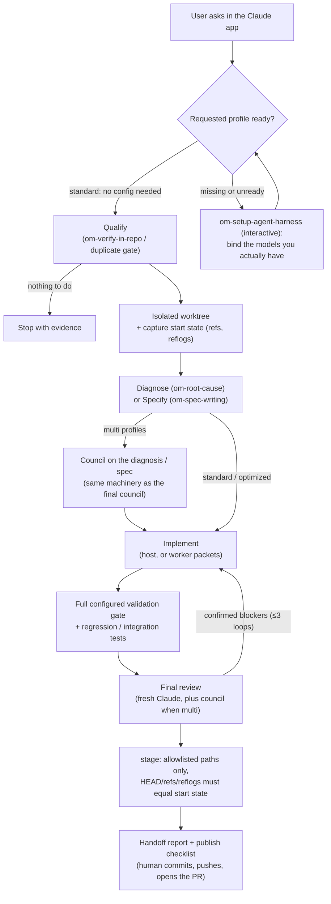
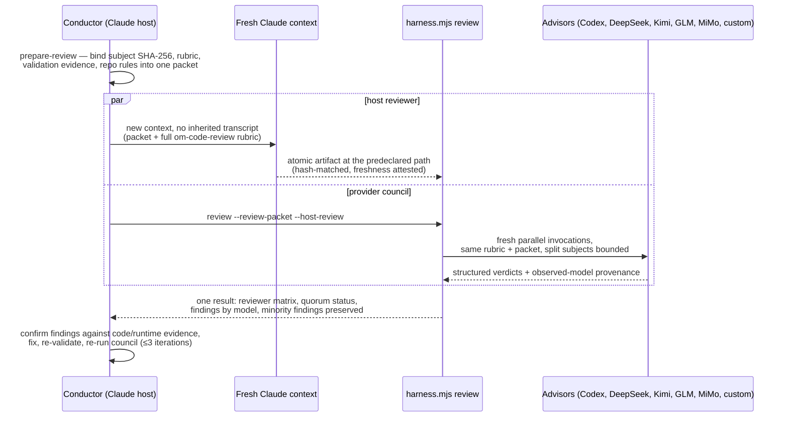
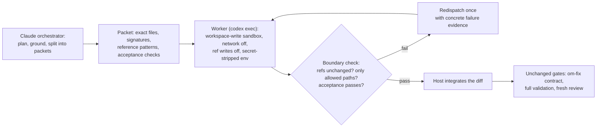
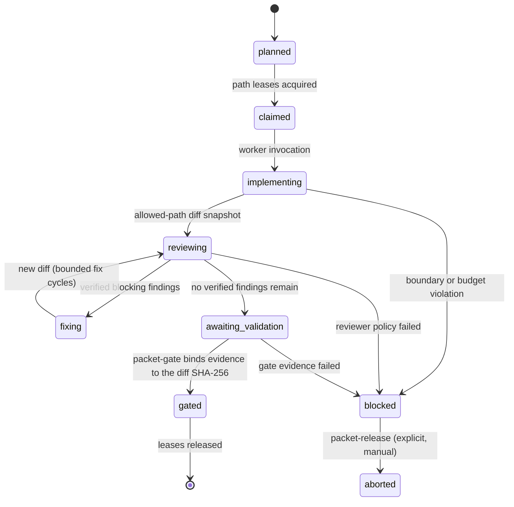

# The staged-only multi-model harness

This folder is the shared runtime behind the staged-only wrapper skills. The
idea in one sentence: **you start a task in the Claude app, optional external
models implement and review it under deterministic contracts, and the run
always ends with a verified staged diff on an unchanged `HEAD` — never a
commit, push, or pull request.** Publication is a human decision.

Everything model-specific is configuration. The only fixed element is Claude
as the host: the conductor context that orchestrates the run and the mandatory
fresh reviewer context both live in the Claude app. Workers and advisors are
pluggable — the bundled jury is a default, not a requirement.

- Agent-facing contracts live in [`SKILL.md`](SKILL.md) and [`references/`](references/).
- The deterministic runtime is [`scripts/harness.mjs`](scripts/harness.mjs).
- The preventive guards live in [`hooks/`](hooks/).
- This README is the human-facing map.

## The skill matrix

Two entry skills, four thin variants each. A variant only selects a profile —
the whole workflow lives in the base skill, so behavior never drifts between
variants.

| You invoke | Profile selected | Who implements | Review gate |
|---|---|---|---|
| `om-fix-issue` / `om-implement-feature` | `standard` | Claude host | Fresh Claude context runs `om-code-review` |
| `om-fix-issue-optimized` / `om-implement-feature-optimized` | `optimized` | Configured worker (audited Codex sandbox) in bounded packets | Fresh Claude context |
| `om-fix-issue-multi` / `om-implement-feature-multi` | `multi` | Claude host | Fresh Claude **plus** every configured advisor, one hash-bound packet |
| `om-fix-issue-multi-optimized` / `om-implement-feature-multi-optimized` | `multi-optimized` | Configured worker | Full council; the worker's model family counts as a self-check, never an independent vote |
| any base skill with `--profile high-assurance` | `high-assurance` | Worker per packet manifest, under path leases | Blind risk-scaled council + fresh finding verification + deterministic evidence gate |

Supporting skills: `om-setup-agent-harness` configures everything below
(models, profiles, hooks, output style); the base skills delegate to the
existing pipeline skills (`om-verify-in-repo`, `om-root-cause`, `om-fix`,
`om-spec-writing`, `om-code-review`, `om-integration-tests`) so the harness
adds model topology without forking the workflow.

## Profiles at a glance

| Profile | Workers | Reviewers | Review policy |
|---|---|---|---|
| `standard` | none | none | Fresh Claude pass only — needs **no** `agentHarness` config at all |
| `optimized` | 1 | none | Advisory |
| `multi` | none | all selected | All-required: every selected reviewer must complete |
| `multi-optimized` | 1 | all selected | All-required; worker family excluded from independence |
| `high-assurance` | 1 | risk-scaled per packet | Blind lenses, fresh verification, separate fixer, hard budgets |

Every selected reviewer is always invoked, and under the shipped
`all-required` policy every one of them must complete: the runtime retries
failed invocations (timeouts, provider errors, invalid JSON) with backoff and
timeout escalation, and a council still missing a required reviewer produces
no verdict and exits non-zero for the wrapper to re-run. Minority findings are
preserved even when a single reviewer raises them. The legacy `quorum` mode
remains available for configs that opt into partial-council tolerance.

## The model registry

Bundled, individually selectable jury (defaults from
`om-setup-agent-harness/references/configuration-template.json`):

| Id | Default binding | Roles |
|---|---|---|
| `codex` | Codex CLI `gpt-5.6-sol`, reasoning `xhigh` | worker + reviewer |
| `deepseek` | `deepseek-v4-pro`, max reasoning | reviewer |
| `kimi` | Managed Kimi CLI `kimi-code/k3`, thinking (= `max` effort on K3) | reviewer |
| `glm` | OpenCode Zen `glm-5.2`, max reasoning | reviewer |
| `mimo` | OpenCode Zen `mimo-v2.5-free`, max reasoning | reviewer |

**Bring your own reviewer.** Any OpenAI-compatible endpoint (hosted gateways or
a local server) and any local CLI that prints the review JSON schema can join
the council — see the provider catalog's *Bring your own reviewer* section.
Custom models are reviewer-only; a worker requires a runtime-audited sandbox
adapter (version 1: `codex-workspace-write-sandbox`).

## End-to-end flow



## How `multi` reviews (the council)

One immutable packet, many independent verdicts, one matrix. No reviewer sees
another reviewer's output, the conductor's transcript, or the implementer's
rationale.



The runtime rejects a stale subject, changed rubric, non-Claude host artifact,
or inherited-context attestation instead of producing a council result. If the
host artifact fails, completed provider results are persisted to
`review-result.partial.json` rather than discarded.

## How `optimized` implements (the worker loop)

The host keeps planning, grounding, integration, and judgment; the worker gets
bounded, file-disjoint packets in an audited sandbox.



A worker packet never replaces the base skill's own gates — `om-fix` (or the
spec's validation phases) still owns the regression test, validation commands,
and review, no matter who typed the code.

## How `high-assurance` runs packets

Each packet is a versioned manifest (risk, allowed paths, invariants,
acceptance criteria) executed by `packet-run` under repository-global path
leases and hard budgets:



A model's claim that a test passed is never gate evidence — the gate takes
trusted command output bound to the reviewed diff, and a drifted diff sends the
packet back to review.

## The safety model (stage-only, layered)

1. **Prevention** — `hooks/block-push-and-pr.sh` denies `git push` and PR
   creation at the tool boundary; `hooks/freeze-tests.sh` denies test edits
   while the fix-phase sentinel exists.
2. **Isolation** — isolated worktrees; workers and command reviewers run with
   secret-stripped environments, no shell, Git protocols and credential
   helpers disabled.
3. **Detection** — refs/reflogs are snapshotted around every worker *and*
   reviewer invocation and at `stage` time; any mutation fails the run.
4. **Trust boundaries** — executable adapter settings come only from the
   trusted base revision plus a user-local overlay; repository text, tracker
   content, and model output are data, never instructions; review packets are
   SHA-256-bound; requested vs observed model provenance is recorded.
5. **Bounded loops** — fix/council loops stop at three iterations; packet
   budgets cap invocations and input bytes.

## First run in a fresh repository

- `om-fix-issue 123` (or `om-implement-feature "..."`) works immediately —
  `standard` needs no provider and no `agentHarness` section.
- `om-fix-issue-multi 123` with nothing configured stops, explains that the
  variant needs model bindings, and routes into `om-setup-agent-harness`
  interactively. After setup it re-probes and continues as `multi`. Falling
  back to `standard` happens only as the user's explicit, informed choice, and
  the report says so.
- Every non-`standard` run opens with a readiness table — one row per selected
  model with its binding and a ✅ ready / 🟥 missing-or-failed status — shown
  before any model is invoked and repeated in the run report.
- `-optimized` additionally requires the audited Codex worker; without it the
  run blocks honestly instead of degrading to host-only implementation.

## Runtime quick reference

```text
node scripts/harness.mjs <command>

configure        install a validated agentHarness object into the pipeline config
validate-config  validate and resolve the harness configuration
resolve-profile  print a profile exactly as the runtime will execute it
probe            readiness-check the profile's workers and reviewers
worker           run one bounded implementation packet
prepare-review   freeze subject + rubric + evidence into an immutable packet
review           run the advisor council and await the fresh Claude artifact
packet-run       claim, implement, blind-review, and fix one manifest packet
packet-gate      bind trusted evidence to the reviewed diff, release leases
packet-status    report packet state, usage, leases, diff identity
packet-release   abort a packet and release its leases explicitly
capture          snapshot refs and reflogs before any edit
stage            stage the allowlisted handoff and assert nothing else changed
```

## Where the details live

| Topic | Contract |
|---|---|
| Config shape, profiles, quorum semantics | [`references/configuration.md`](references/configuration.md) |
| Adapters, placeholders, worker security | [`references/adapter-contract.md`](references/adapter-contract.md) |
| Council procedure and fresh-Claude attestation | [`references/code-review-contract.md`](references/code-review-contract.md) |
| Packet lifecycle, leases, budgets | [`references/packet-contract.md`](references/packet-contract.md) |
| Staging assertions | [`references/stage-only-contract.md`](references/stage-only-contract.md) |
| Reporting and reconciliation | [`references/reporting.md`](references/reporting.md) |
| JSON schemas (packets, results, gate evidence) | [`references/*.schema.json`](references/) |

## Maintainers

<p align="center">
  <a href="https://www.omdyo.com">
    
  </a>
</p>

<p align="center">
  <strong>Developed and maintained by <a href="https://www.omdyo.com">Omdyo</a></strong> — an agency building digital systems for real operations.<br/>
  Commercial support, custom agent-pipeline and multi-model review work → <a href="https://www.omdyo.com"><strong>www.omdyo.com</strong></a>
</p>

<p align="center"><sub>Staged-only multi-model agent harness · MIT-licensed</sub></p>
