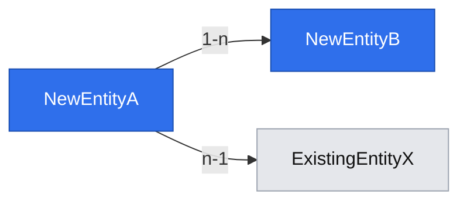

# Data model graph (step 6 — Design)

Called from `om-spec-writing` step 6, right after the spec's own `## 📝 Data Model` section is drafted, to visualize the new/changed entities and how they connect to the existing system.

## When to run

Skip entirely when the Data Model section introduces no new or changed entities (pure UI/API-shape specs, config-only changes). Never generate an empty or trivial graph.

## 1. Extract entities and relations from the spec

From the `## 📝 Data Model` section just written: list each new/changed entity, its key fields, and its relations (1-1 / 1-n / n-n) to the other entities in that same section.

## 2. Find existing entities related to the new ones

Search the repo's own schema/model layer for entities the new ones reference or that reference the new ones — ORM models, migrations, `schema.prisma`, SQL DDL, entity classes, whatever this repo already uses. Do not invent a new schema convention to search for; follow the one the codebase already has.

- Pull in only entities with a **direct** relation (foreign key, embed, explicit reference) to a new/changed entity — never the whole schema.
- For each pulled-in existing entity, note only the fields relevant to the relation, not its full definition.

## 3. Always: static diagram embedded in the spec

Embed a Mermaid `flowchart` diagram directly under the `## 📝 Data Model` section — this renders inline in any Markdown viewer with no extra tooling, and is the deliverable of record even if nobody opens the HTML file from step 4:

- One node per entity, one labeled edge per relation (cardinality on the label).
- Two `classDef`s color-code new vs. existing — keep this palette or the repo's existing diagram palette if one is documented; the point is a consistent, visible distinction, not the exact colors.

## 4. Optional: interactive HTML in `DATA_MODEL_DIR`

Only in interactive runs (skip under `--autonomous` — nobody is watching a browser during an unattended run) and only when `DATA_MODEL_DIR` resolves (step 0): additionally write a single self-contained HTML file at `{DATA_MODEL_DIR}/{spec-filename}.html`.

- No external CDN dependency — inline SVG plus vanilla JS for pan (drag), zoom (wheel), and click-to-focus (click a node to dim everything but its direct neighbors).
- Same nodes, edges, and new/existing color coding as the Mermaid diagram in step 3 — this file is a convenience for humans exploring a large model, never a dependency for the next skill in the chain. The Mermaid diagram is authoritative.

## Rules

- This still produces only documentation, never code — "the deliverable is the document" from the skill body's Rules applies here too.
- Never draw a relation that isn't backed by the spec's own Data Model section or by what step 2 actually found in the existing schema — no inferred or guessed relations.
